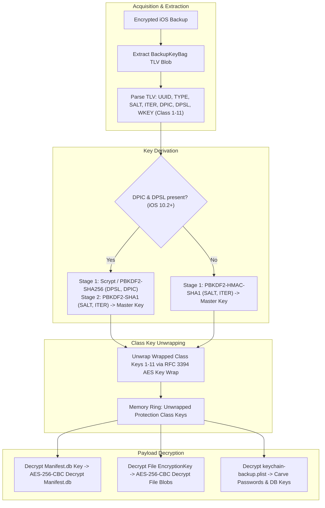

# 🏛️ iForensic — Complete Project Architecture & Context Archive

> **Document Version:** 1.0.0  
> **Target Audience:** AI Agents, Forensic Investigators, Systems Engineers, Core Maintainers  
> **Repository:** [https://github.com/arthurrgg8-lgtm/iforensic](https://github.com/arthurrgg8-lgtm/iforensic)  
> **Lead Developer:** LazZy (`ANUDITKHATRI2011@GMAIL.COM`)  
> **Forensic Standards:** Court & Disclosure Ready | NIST CFTT | ISO/IEC 27037:2012 | RFC 3394 AES Key Wrap | RFC 8089 URI  

---

## 1. Executive Summary & Purpose

**iForensic** is an enterprise-grade, cross-platform (Linux, macOS, Windows) iOS digital forensics and multi-artifact extraction suite. It bridges the gap between hardware physical acquisition, encrypted bitstream carving, hardware-level keychain unwrapping, and executive multi-format reporting (DOCX, Interactive Offline HTML, and structured Plain-Text folder trees).

### Core Capabilities at a Glance:
1. **1-Command Autonomous Pipeline:** Auto-detects connected USB iOS hardware, validates lockdown pairing, resolves encrypted/unencrypted evidence, and carves all databases in a single execution (`iforensic --auto`).
2. **Hardware AES-256 Decryption Engine:** Derives master keys via PBKDF2/scrypt, unwraps Protection Classes 1–11 (RFC 3394), and performs on-the-fly decryption of `Manifest.db`, raw file blobs, and SQLite databases.
3. **Hardware Keychain & Cryptographic Key Carving:** Decrypts `keychain-backup.plist` to carve plain-text Wi-Fi passphrases, Safari web credentials, app-specific cipher keys (e.g., Signal `OWSPrimaryStorageCipherKey`), and asymmetric/symmetric cryptographic keys.
4. **Categorized Plain-Text Evidence Exporter:** Automatically compiles evidence into numbered, intuitive directories (`01_Extracted_Plain_Evidence/`) containing `.txt` chat logs, notes, `.csv` spreadsheets, `.json` dumps, and decrypted `.db` SQLite files.
5. **⚡ Quick Selective Triage Engine (<3s):** Rapid extraction presets for immediate tactical intelligence (comms, notes, passwords, financial ledgers).
6. **Automated Startup Maintenance & Self-Healing:** Auto-checks GitHub for upstream updates on every launch, prompts for seamless 1-click update, heals `usbmuxd` sockets, and clears orphaned locks.
7. **2-Tier Emergency Troubleshooting:** Tier 1 self-repair + Tier 2 forensic incident telemetry dump (`forensic_incident_dump_*.json`) with lead developer escalation.

---

## 2. Directory & Module Architecture

```
/home/lazzy/Desktop/iforensic/
├── cli.py                                    # Master CLI Entry Point, Rich Menus, Argument Parser & Pipeline Orchestrator
├── setup.py                                  # Setuptools Package Configuration (CLI entry point: 'iforensic')
├── pyproject.toml                            # PEP 517/621 Build Specification
├── README.md                                 # Public User & Investigator Documentation
├── PROJECT_CONTEXT_ARCHIVE.md                # Complete Technical Architecture Archive (This Document)
├── .gitignore                                # Comprehensive Python/Forensic Git Exclusion Filter
│
├── core/                                     # Foundational Forensic Engines
│   ├── __init__.py
│   ├── crypto_engine.py                      # BackupKeyBag TLV Parser, PBKDF2/scrypt KDF, RFC 3394 AES Key Unwrap, AES-256-CBC Decryptor
│   ├── manifest_resolver.py                  # iOS Manifest.db / Manifest.plist Pointer Resolution & On-The-Fly Decryption Caching
│   ├── device_detector.py                    # USB Hardware Detection, Lockdown Cryptographic Pairing, Diagnostics, & Socket Healing
│   ├── hardware_imaging.py                   # Write-Blocker (ro,noatime) Verification, Checkm8 DFU Profiler (A7-A11)
│   ├── hash_verifier.py                      # Multi-Threaded Streaming NIST CFTT Hashes (SHA-256 / MD5) & Chain of Custody
│   ├── storage_manager.py                    # Storage Target Selector, Auto-Mounting External USB Storage Media
│   ├── maintenance_manager.py                # Online Update Check, Upstream Git Pull, Self-Updating & Housekeeping
│   ├── troubleshooter.py                     # Autonomous Diagnostics, Self-Repair, Crash Telemetry & Developer Escalation
│   ├── timeline.py                           # Super-Timeline Chronological Event Synthesizer
│   ├── time_utils.py                         # Mac Epoch (2001) / Unix Epoch / WebKit Timestamp Conversion Utilities
│   └── db_utils.py                           # Read-Only RFC 8089 SQLite Connection Helper with Schema Inspection
│
├── parsers/                                  # Artifact-Specific Carvers & Decoders
│   ├── __init__.py
│   ├── keychain_parser.py                    # iOS Keychain (genp, inet, keys, cert) Decryption & Secret Classification
│   ├── sms_parser.py                         # sms.db Carver & iOS 16/17/18+ NSAttributedString TypedStream Decoder
│   ├── calls_parser.py                       # CallHistory.storedata Carver & Duration/Status Telemetry Analyzer
│   ├── contacts_parser.py                    # AddressBook.sqlitedb Parser & Truecaller Cache Cross-Referencing
│   ├── notes_parser.py                       # NoteStore.sqlite Gzip Blob Decompression & Protobuf Data Decompiler
│   ├── whatsapp_parser.py                    # ChatStorage.sqlite Group & Direct Message Extractor
│   ├── enterprise_apps_parser.py             # Telegram (tgdata.db), Signal (signal.sqlite), Teams, ProtonMail Decoders
│   ├── financial_parser.py                   # Bank OTPs, Transaction Ledger, eSewa/Khalti/UPI Transfer Scanner
│   ├── recordings_parser.py                  # Apple Voice Memos, Voicemails (Transcripts), Raw Audio Indexer (.m4a/.opus/.wav)
│   ├── safari_parser.py                      # SafariHistory.db / History.db Browsing Timeline Carver
│   ├── photos_parser.py                      # Photos.sqlite EXIF Metadata & Geotag Extractor
│   ├── data_usage_parser.py                  # DataUsage.sqlite Cellular & Wi-Fi Network Consumption Analyzer
│   └── universal_apps_parser.py              # Zero-Day / Unlisted Third-Party Database Schema & Chat Heuristic Carver
│
└── exporters/                                # Report Generation & Evidence Tree Builders
    ├── __init__.py
    ├── plain_text_tree_exporter.py           # Structured Categorized Folder Tree Exporter (TXT, CSV, JSON, Decrypted DBs)
    ├── docx_report.py                        # Executive Court-Ready DOCX Intelligence Report Generator
    └── html_dashboard.py                     # Offline Single-File Interactive HTML5 Dashboard with Instant Search
```

---

## 3. Cryptographic Subsystem (Hardware KeyBag & Decryption)



### Key Components in `core/crypto_engine.py`:
* **`BackupKeyBag` Class:** Parses Tag-Length-Value (`TLV`) records from `Manifest.plist` or raw bytes. Extracts `UUID`, `TYPE`, `SALT`, `ITER`, `DPIC` (Scrypt iterations), `DPSL` (Scrypt salt), and wrapped class keys (`WKEY`).
* **`CryptoEngine.verify_and_unlock(passphrase)`:** Derives the Master Key and verifies it against the wrapped class keys using `cryptography.hazmat.primitives.keywrap.aes_key_unwrap` (RFC 3394).
* **`CryptoEngine.decrypt_manifest_db(output_path)`:** Unwraps the `ManifestKey` blob using Protection Class 3 (or fallback) and decrypts `Manifest.db` via AES-256-CBC with zero IV.
* **`CryptoEngine.decrypt_file(encrypted_file_path, file_blob_bytes, output_path)`:** Parses the per-file metadata plist blob, extracts `ProtectionClass` and `EncryptionKey`, unwraps the 32-byte AES file key, and decrypts ciphertext with PKCS#7 unpadding.
* **`CryptoEngine.get_keybag_summary()`:** Returns complete structured telemetry describing the KeyBag parameters.
* **`CryptoEngine.export_keybag_manifest(output_path)`:** Generates a court-ready `Cryptographic_KeyBag_Manifest.txt`.

### Keychain Extraction in `parsers/keychain_parser.py`:
* Parses `keychain-backup.plist` or `Keychain.plist`.
* Unwraps entries in `genp` (Generic Passwords), `inet` (Internet Passwords), `keys` (Cryptographic Keys), and `cert` (Certificates) across all Protection Classes.
* Automatically categorizes:
  1. **Wi-Fi SSIDs & Passwords:** Extracted from AirPort network entries.
  2. **Saved Web Logins:** Safari passwords, account names, and URLs.
  3. **Application Database Keys:** Secret tokens including Signal SQLCipher `OWSPrimaryStorageCipherKey`.
  4. **Cryptographic Keyring:** AES-256 keys, private keys, and public certificates.

---

## 4. Categorized Plain-Text Evidence Tree (`01_Extracted_Plain_Evidence`)

Implemented in `exporters/plain_text_tree_exporter.py`, this engine structures all parsed and decrypted forensic data into an intuitive, court-ready folder hierarchy:

```
01_Extracted_Plain_Evidence/
├── 00_CASE_METADATA_AND_SUMMARY.txt          # Case summary, device telemetry, timestamps, custody hashes
├── 01_Messages_SMS_iMessage/
│   ├── messages_chat_transcript.txt          # Human-readable conversational transcripts
│   ├── messages_database.csv                 # Tabular messages export
│   └── messages_records.json                 # Complete structured JSON records
├── 02_Calls_and_Voicemails/
│   ├── call_history_summary.txt              # Call logs with duration & status
│   ├── call_history.csv                      # Tabular call history
│   ├── voicemail_transcripts.txt             # Visual voicemail transcripts & audio paths
│   └── call_records.json
├── 03_Contacts_and_Identities/
│   ├── contacts_directory.txt                # Unified phonebook & Truecaller identities
│   ├── contacts_directory.csv                # Tabular contact records
│   └── contacts_records.json
├── 04_Notes_and_Passwords/
│   ├── notes_summary_index.txt               # Master index of Apple Notes
│   ├── notes_records.json                    # Notes JSON dump
│   └── individual_notes_plain/               # Standalone .txt file for EVERY individual note
│       ├── Note_001_Title.txt
│       └── Note_002_Title.txt
├── 05_Decrypted_Keychain_and_Keys/
│   ├── wifi_passwords_and_networks.txt       # Plain-text SSIDs & Wi-Fi passwords
│   ├── saved_web_logins_and_passwords.txt    # Safari & cloud logins
│   ├── app_database_cipher_keys.txt          # Signal SQLCipher key, app DB tokens
│   ├── cryptographic_key_ring.txt            # Asymmetric & symmetric crypto key ring
│   ├── Cryptographic_KeyBag_Manifest.txt     # KeyBag UUID, KDF, & Class Key unwrap status
│   └── Keychain_Decrypted_Secrets.json       # Complete decrypted secrets dictionary
├── 06_Financial_Ledger_and_OTPs/
│   ├── financial_ledger_summary.txt          # Banking debits, credits, account numbers
│   ├── financial_transactions.csv            # Structured financial ledger
│   ├── bank_otps_and_alerts.txt              # 2FA verification codes & SMS alerts
│   └── financial_records.json
├── 07_Enterprise_Cloud_Apps/
│   ├── telegram_chat_transcripts.txt         # Telegram messages & user IDs
│   ├── teams_collaboration_logs.txt          # Microsoft Teams channels & direct chats
│   ├── signal_encrypted_app_dump.json        # Signal decrypted session data
│   └── protonmail_records.json               # ProtonMail secure inbox items
├── 08_WhatsApp_Chats/
│   ├── whatsapp_chat_log.txt                 # Formatted conversation threads
│   ├── whatsapp_messages.csv                 # Tabular WhatsApp chats
│   └── whatsapp_records.json
├── 09_Web_History_and_Activity/
│   ├── safari_browsing_history.txt           # Visited URLs & timestamps
│   ├── safari_browsing_history.csv           # Tabular browsing timeline
│   └── app_network_data_usage.json           # Cellular & Wi-Fi app data usage
├── 10_Master_Forensic_Timeline/
│   ├── master_chronological_timeline.txt     # Unified chronological multi-source timeline
│   ├── master_chronological_timeline.csv     # Universal timeline spreadsheet
│   └── master_chronological_timeline.json
└── 11_Decrypted_SQLite_Databases/
    ├── sms.db                                # Decrypted SMS/iMessage SQLite DB
    ├── CallHistory.storedata                 # Decrypted Call History SQLite DB
    ├── AddressBook.sqlitedb                  # Decrypted Contacts SQLite DB
    ├── NoteStore.sqlite                      # Decrypted Apple Notes SQLite DB
    └── History.db                            # Decrypted Safari Browsing SQLite DB
```

---

## 5. Startup Maintenance & Autonomous Self-Healing

Implemented in `core/maintenance_manager.py` and `core/troubleshooter.py`:

1. **Network Connectivity & Update Check:**
   - Probes `github.com:443` with a non-blocking timeout.
   - Executes non-blocking `git fetch --quiet origin` to check if upstream commits or firmware offsets are available.
   - If updates exist, interactively prompts the user:
     `"⚡ NEW FORENSIC UPDATE & DEVICE DEFINITIONS FOUND. Would you like to auto-update and start now? [Y/n]"`
   - On confirmation, runs `git pull --ff-only` and re-compiles the package automatically (`pip install -e . --break-system-packages`).
2. **Autonomous Socket Self-Healing:**
   - Detects stale or hanging `usbmuxd` socket locks and restarts the daemon automatically.
   - Purges orphaned temporary staging files in `/tmp` and `~/.iforensic_temp`.
3. **2-Tier Emergency Troubleshooting:**
   - **Tier 1:** Automated system repair.
   - **Tier 2:** Compiles comprehensive incident telemetry dump (`forensic_incident_dump_<timestamp>.json`) containing stack traces, OS release info, and device profiles, and displays the emergency developer contact:
     * **Lead Developer:** `ANUDITKHATRI2011@GMAIL.COM`

---

## 6. Execution Modes & Command-Line Reference

```bash
# 1. Interactive Guided Wizard (Default)
iforensic

# 2. 1-Click Fully Autonomous Mode (Detect USB, Pair, Decrypt/Prompt, Carve, Report)
iforensic --auto
# or: iforensic -a

# 3. ⚡ Quick Selective Fetch (<3s Triage Mode)
iforensic --quick -b /path/to/backup -p "passphrase"
# or: iforensic -q

# 4. 🔬 100% Full Deep Forensic Acquisition & Full Carve
iforensic --full -b /path/to/backup -p "passphrase"
# or: iforensic -f

# 5. Targeted Specific Modules Only
iforensic -b /path/to/backup -t "messages,calls,notes,keychain,financial" -p "passphrase"

# 6. Custom Output Destination
iforensic -b /path/to/backup -o /media/user/ExternalDrive/Case_01 -p "passphrase"
```

---

## 7. Interactive CLI Menu Map

| Option | Action | Description |
|---|---|---|
| `[1]` | **Quick Selective Fetch** | Rapid tactical triage preset selector or custom module checkboxes (<3s) |
| `[2]` | **Full Deep Forensic Acquisition** | 100% complete bitstream carving with NIST CFTT verification across all artifacts |
| `[3]` | **1-Click Auto-Fetch** | Autonomous hardware probe, pairing handshake, and extraction |
| `[4]` | **Live USB Hardware Diagnostics** | Lockdown pairing wizard, device telemetry profile, Checkm8 DFU evaluation |
| `[5]` | **Ingest Existing Backup** | Scans local filesystem and storage devices for iOS backup folders |
| `[6]` | **Universal Entity Search** | Global multi-database grep across SMS, calls, notes, financial, and keychain secrets |
| `[7]` | **System & Storage Diagnostics** | Toolchain status check and external USB drive auto-detection/mounting |
| `[8]` | **Unlisted App Inspector** | Discovers all unknown SQLite DBs and inspects schemas/tables interactively |
| `[9]` | **Autonomous Troubleshooter** | Runs self-healing diagnostic repair routine across all system layers |
| `[10]` | **Decrypt & Unlock Evidence** | Unlocks encrypted backups using extracted KeyBag & passphrase at any time |
| `[0]` | **Exit** | Cleanly exits the forensic suite preserving all integrity hashes |

---

## 8. Chain of Custody & Legal Compliance

* **Compliance Standards:** NIST CFTT, ISO/IEC 27037:2012 (Digital Evidence Handling).
* **Read-Only Integrity:** All SQLite database connections enforce read-only URI mode (`file:/path?mode=ro`).
* **Cryptographic Verification:**
  * Streaming SHA-256 and MD5 computed for all source evidence files.
  * Master evidence hash recorded in `Chain_of_Custody_Manifest.txt` and `Chain_of_Custody_Verification.json`.
  * Key unwrap parameters logged in `Cryptographic_KeyBag_Manifest.txt` following NIST SP 800-38F.

---

## 9. Developer Guidelines & Extension Instructions

When adding new application parsers or enhancing existing modules:
1. **Adding a New Parser:**
   - Create `parsers/<app>_parser.py` implementing a `parse()` method returning structured dictionaries.
   - Use `ManifestResolver.find_file(filename=...)` or `ManifestResolver.find_files_by_domain(domain=...)` to resolve files.
   - Update `PlainTextTreeExporter` to generate corresponding plain-text `.txt`, `.csv`, and `.json` logs.
2. **Maintaining Cross-Platform Support:**
   - Always use `os.path.join` and `os.path.abspath`.
   - Never hardcode POSIX-only shell commands; check `platform.system()` or use `shutil.which`.
3. **Preserving Documentation & Escalation:**
   - Ensure Lead Developer contact `ANUDITKHATRI2011@GMAIL.COM` is preserved across all diagnostic and telemetry dump routines.
